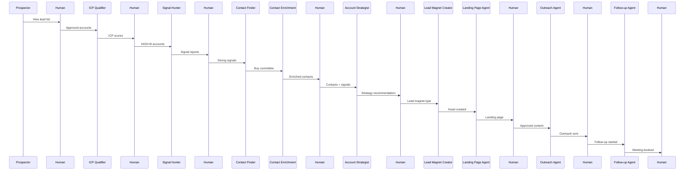

```mermaid
flowchart TD
    %% Styles
    classDef agent fill:#4f46e5,stroke:#3730a3,color:#fff
    classDef human fill:#059669,stroke:#047857,color:#fff
    classDef decision fill:#f59e0b,stroke:#b45309,color:#fff
    classDef output fill:#1e293b,stroke:#334155,color:#fff

    %% Phase 1: Prospecting
    A[🤖 Prospector]:::agent --> B{New Accounts?}:::decision
    B -->|Yes| C[📋 Qualified Leads]:::output
    B -->|No| A
    
    C --> D[👤 Human #1]:::human
    D -->|Approve| E[🤖 ICP Qualifier]:::agent
    
    %% Phase 2: ICP Validation
    E --> F{ICP Score}:::decision
    F -->|HIGH| G[✅ HIGH-Fit Accounts]:::output
    F -->|LOW/MEDIUM| H[❌ Out of Scope]:::output
    F -->|Unclear| I[🤖 Signal Hunter]:::agent
    
    G --> J[👤 Human #2]:::human
    
    %% Phase 3: Signal Detection
    J --> K[🤖 Signal Hunter]:::agent
    K --> L{Signals Found?}:::decision
    L -->|Strong| M[📊 Signal Report]:::output
    L -->|Weak| N[❌ No Signals]:::output
    
    M --> O[👤 Human #3]:::human
    
    %% Phase 4: Contact Discovery
    O --> P[🤖 Contact Finder]:::agent
    P --> Q[👥 Buying Committee]:::output
    Q --> R[🤖 Contact Enrichment]:::agent
    R --> S[📇 Enriched Contacts]:::output
    
    S --> T[👤 Human #4]:::human
    
    %% Phase 5: Strategy
    T --> U[🤖 Account Strategist]:::agent
    U --> V{Decision}:::decision
    V -->|Direct| W[📝 Direct Play]:::output
    V -->|Lead Magnet| X[🎁 Lead Magnet Play]:::output
    
    W --> Y[👤 Human #5]:::human
    X --> Y
    
    %% Phase 6: Content Creation
    Y --> Z[🤖 Lead Magnet Creator]:::agent
    Z --> AA{Type}:::decision
    AA -->|ROI Calc| AB[🧮 ROI Calculator]:::output
    AA -->|Benchmark| AC[📊 Benchmark Report]:::output
    AA -->|Case Study| AD[📖 Case Study]:::output
    
    AB --> AE[🤖 Landing Page Agent]:::agent
    
    %% Phase 7: Landing Page
    AE --> AF[🌐 Personalized Page]:::output
    AF --> AG[👤 Human #6]:::human
    
    %% Phase 8: Outreach
    AG --> AH[🤖 Outreach Agent]:::agent
    AH --> AI{Channel}:::decision
    AI -->|LinkedIn| AJ[💼 LinkedIn]:::output
    AI -->|Email| AK[📧 Email]:::output
    AI -->|Multi| AL[🔄 Multi-Channel]:::output
    
    AJ --> AM[📬 Messages Sent]:::output
    AK --> AM
    AL --> AM
    
    AM --> AN[👤 Human #7]:::human
    
    %% Phase 9: Follow-up
    AN --> AO[🤖 Follow-up Agent]:::agent
    AO --> AP{Booked?}:::decision
    AP -->|Yes| AQ[✅ Meeting]:::output
    AP -->|No| AR[🔄 Nurture]:::output
    
    AQ --> AS[👤 Human #8 - Handoff]:::human
```

## Agent Summary Table

| # | Agent | Task | Output |
|---|-------|------|--------|
| 1 | Prospector | Find new ICP accounts | Account list |
| 2 | ICP Qualifier | Score against ICP | HIGH/MEDIUM/LOW |
| 3 | Signal Hunter | Find buying signals | Signal report |
| 4 | Contact Finder | Map buying committee | Names + titles |
| 5 | Contact Enrichment | Get contact details | Emails + LinkedIn |
| 6 | Account Strategist | Plan approach | Direct vs. Lead Magnet |
| 7 | Lead Magnet Creator | Build asset | ROI Calc / Report / Case Study |
| 8 | Landing Page Agent | Build personalized page | URL |
| 9 | Outreach Agent | Send messages | Delivered |
| 10 | Follow-up Agent | Nurture + book meeting | Meeting |

## Human Checkpoints

| # | When | What |
|---|------|------|
| 1 | After Prospecting | Approve lead list |
| 2 | After ICP Scoring | Approve HIGH-fit |
| 3 | After Signals | Approve strong signals |
| 4 | After Contacts | Verify accuracy |
| 5 | After Strategy | Approve approach |
| 6 | Before Landing Page | Review content |
| 7 | Before Outreach | Approve message |
| 8 | After Follow-up | Hand off to sales |
